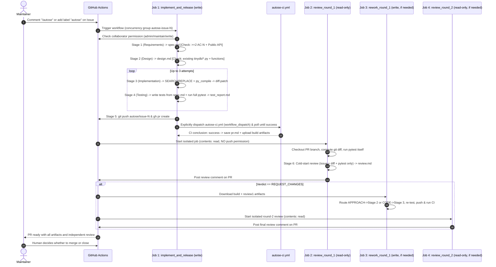

# Architecture Sequence View (One Complete Run)

```mermaid
sequenceDiagram
    autonumber
    actor Maintainer
    participant GH as GitHub Actions
    participant Build as Job 1: implement_and_release (write)
    participant CI as autose-ci.yml
    participant Rev1 as Job 2: review_round_1 (read-only)
    participant Rework as Job 3: rework_round_1 (write, if needed)
    participant Rev2 as Job 4: review_round_2 (read-only, if needed)

    Maintainer->>GH: Comment "/autose" or add label "autose" on Issue #N
    GH->>Build: Trigger workflow (concurrency group autose-issue-N)
    Build->>GH: Check collaborator permission (admin/maintain/write)
    Build->>Build: Stage 1 (Requirements) -> spec.md [Check: >=2 AC-N + Public API]
    Build->>Build: Stage 2 (Design) -> design.md [Check: existing tinydb/*.py + functions]
    loop Up to 3 attempts
        Build->>Build: Stage 3 (Implementation) -> SEARCH/REPLACE + py_compile -> diff.patch
        Build->>Build: Stage 4 (Testing) -> write tests from spec.md + run full pytest -> test_report.md
    end
    Build->>GH: Stage 5: git push autose/issue-N & gh pr create
    Build->>CI: Explicitly dispatch autose-ci.yml (workflow_dispatch) & poll until success
    CI-->>Build: CI conclusion: success -> save pr.md + upload build artifacts

    GH->>Rev1: Start isolated job (contents: read, NO push permission)
    Rev1->>Rev1: Checkout PR branch, compute git diff, run pytest itself
    Rev1->>Rev1: Stage 6: Cold-start review (issue + diff + pytest only) -> review.md
    Rev1->>GH: Post review comment on PR #P
    alt Verdict == REQUEST_CHANGES
        GH->>Rework: Download build + review1 artifacts
        Rework->>Rework: Route APPROACH->Stage 2 or CODE->Stage 3, re-test, push & run CI
        GH->>Rev2: Start isolated round-2 review (contents: read)
        Rev2->>GH: Post final review comment on PR #P (max 2 rounds reached)
    end
    GH-->>Maintainer: PR ready with all artifacts and independent review
    Maintainer->>GH: Human decides whether to merge or close
```
