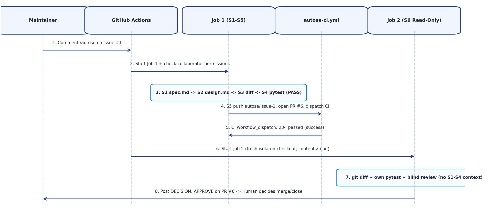
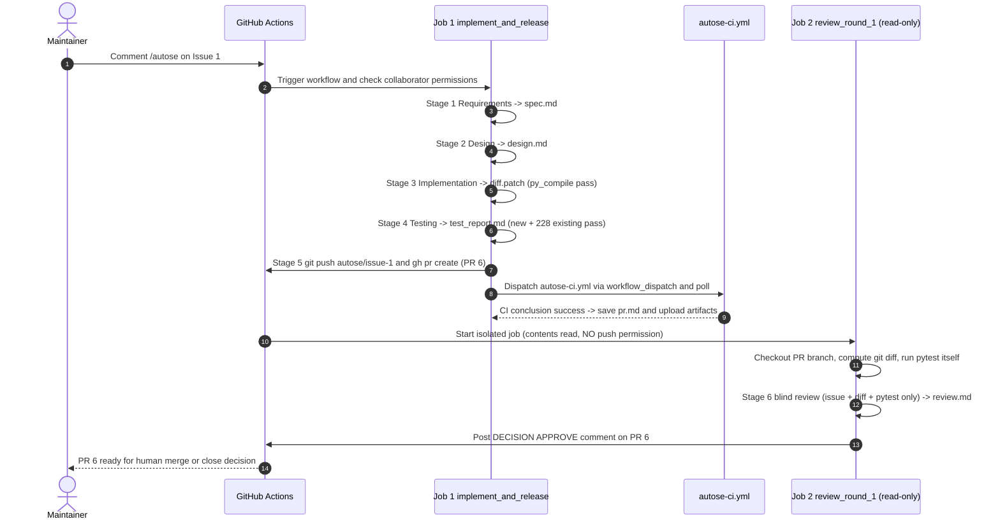

# Architecture Sequence View (Real Run: Issue #1 -> Run 45017452563 -> PR #6)

## Mermaid Diagram (Source)

```mermaid
sequenceDiagram
    autonumber
    actor Maintainer
    participant GH as GitHub Actions
    participant Build as Job 1 implement_and_release
    participant CI as autose-ci.yml
    participant Rev1 as Job 2 review_round_1 (read-only)

    Maintainer->>GH: Comment /autose on Issue 1
    GH->>Build: Trigger workflow and check collaborator permissions
    Build->>Build: Stage 1 Requirements -> spec.md
    Build->>Build: Stage 2 Design -> design.md
    Build->>Build: Stage 3 Implementation -> diff.patch (py_compile pass)
    Build->>Build: Stage 4 Testing -> test_report.md (new + 228 existing pass)
    Build->>GH: Stage 5 git push autose/issue-1 and gh pr create (PR 6)
    Build->>CI: Dispatch autose-ci.yml via workflow_dispatch and poll
    CI-->>Build: CI conclusion success -> save pr.md and upload artifacts
    GH->>Rev1: Start isolated job (contents read, NO push permission)
    Rev1->>Rev1: Checkout PR branch, compute git diff, run pytest itself
    Rev1->>Rev1: Stage 6 blind review (issue + diff + pytest only) -> review.md
    Rev1->>GH: Post DECISION APPROVE comment on PR 6
    GH-->>Maintainer: PR 6 ready for human merge or close decision
```
